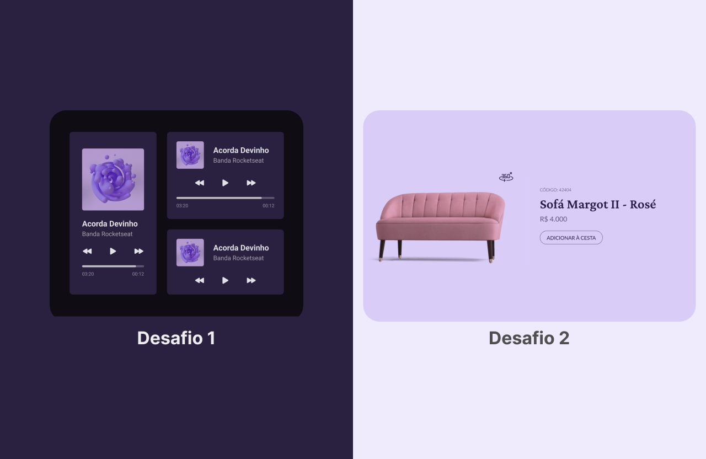
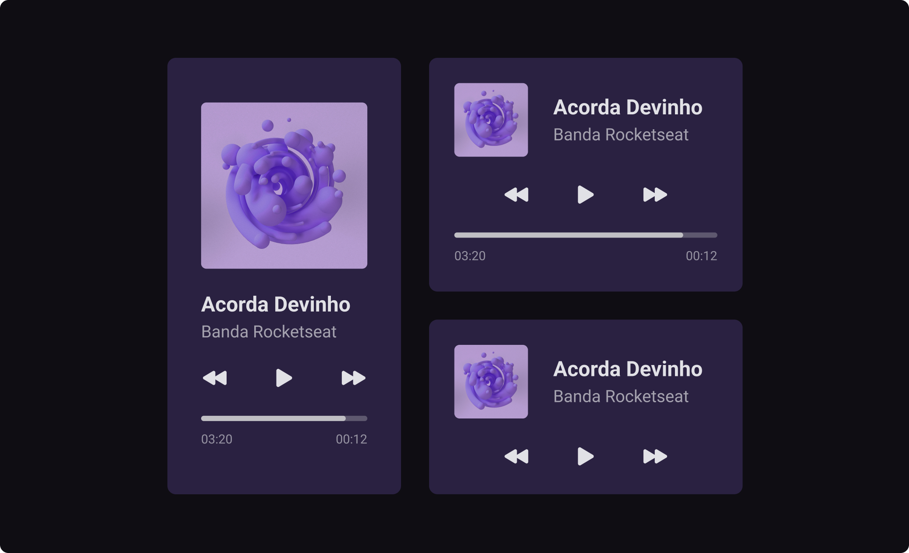

# Bora Codar

Desafio proposto pela [Rocketseat](https://rocketseat.com.br), com intuito de estimular desenvolvedores a criar o front-end de uma pagina, baseado no Design do Figma

## Techs

> Tecnologias utilizadas para desenvolver os desafios 1 e 2

- [x] React.js
- [x] Vite
- [x] Typescript
- [x] Figma
- [x] Turborepo
- [x] Netlify

Baseando nas telas dos desafios 1 e 2, tomei a liberdade de prototipar e desenvolver uma **landing** page para apresentação dos 2 projetos proposto pelo desafio,
aproveitei o gancho e implantei uma arquitetura de monorepo aos projetos para facilitar na criação da **landing** e poder compartilhar pacotes entre projetos, e também fiz deploy no netlify

## Landing

- [Deploy](https://bora-codar.netlify.app/)
- [Figma Design](https://www.figma.com/file/UsXLcRmkscUuVVJO11ss6L/BoraCodar?t=Ml56hHub9noVukOE-6)

## Desafio 1

- [Deploy](https://bora-codar-desafio-1.netlify.app/)
- [Figma Design](<https://www.figma.com/file/SBL6HoKR1pHR8J31r5pxYf/%23boraCodar---Desafio-1-(Community)?node-id=0%3A1&t=7YeTIqViJ8KqjfHn-1>)

## Desafio 2

- [Deploy](https://bora-codar-desafio-2.netlify.app/)
- [Figma Design](<https://www.figma.com/file/edmgH5sSRH7PpuedV9qsso/%23boraCodar---Desafio-2-(Community)?node-id=0%3A1&t=iimTqeYxn2ioS5I5-1>)

